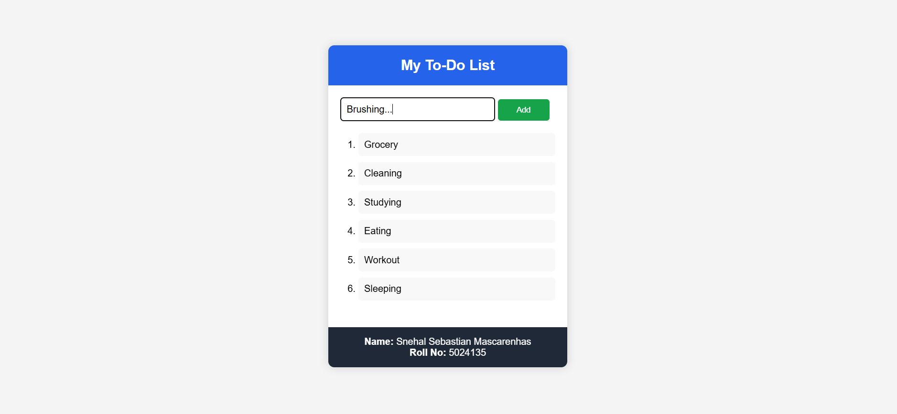
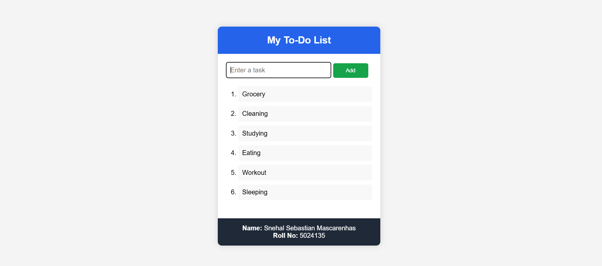

# ✅ Laravel To-Do List

**A Simple To-Do List Web Application**

A beginner-friendly Laravel project built using **Laravel Blade**, **HTML**, **CSS**, and **JavaScript**. This application allows users to add tasks to a numbered to-do list through a clean and responsive interface. It also includes a personalized footer displaying the developer's name and roll number.

---

## 📸 Screenshots

### ➕ Add Tasks

Users can enter a task and click the **Add** button to add it to the numbered task list.



### 📋 Numbered To-Do List

Tasks are displayed in an automatically numbered list.



---

## ✨ Features

| Feature | Description |
|---------|-------------|
| ✅ Add Tasks | Add new tasks instantly |
| 🔢 Numbered List | Tasks are automatically numbered |
| ⚡ Dynamic Updates | Tasks appear instantly without refreshing the page |
| 🎨 Clean User Interface | Simple, responsive, and beginner-friendly design |
| 👩‍💻 Personalized Footer | Displays developer name and roll number |
| 📱 Responsive Design | Compatible with desktop and mobile devices |

---

## 🛠 Tech Stack

| Technology | Purpose |
|------------|---------|
| Laravel | PHP Framework |
| Blade | Laravel Templating Engine |
| HTML5 | Structure |
| CSS3 | Styling |
| JavaScript | Dynamic task management |

---

## 🚀 Getting Started

### Prerequisites

- PHP 8.2 or later
- Composer
- Node.js & NPM
- Laravel Herd (Recommended)

---

## 📦 Installation

```bash
# Clone the repository
git clone https://github.com/SnehalBytes/LaravelAssignment.git

# Open the project
cd LaravelAssignment

# Install PHP dependencies
composer install

# Install JavaScript dependencies
npm install

# Copy environment file
cp .env.example .env

# Generate application key
php artisan key:generate

# Start the development server
composer run dev
```

Open your browser and visit:

```
http://127.0.0.1:8000
```

---

## 📂 Project Structure

```
LaravelAssignment
│
├── app
├── bootstrap
├── config
├── database
├── public
├── resources
│   └── views
│       └── welcome.blade.php
├── routes
├── storage
├── tests
├── artisan
└── composer.json
```

---

## 🎯 How to Use

1. Launch the application.
2. Enter a task in the input field.
3. Click the **Add** button.
4. The task will be added to the numbered list.
5. Continue adding tasks as needed.

---

## 🌟 Future Improvements

- 🗑 Delete tasks
- ✏️ Edit tasks
- ✔️ Mark tasks as completed
- 💾 Store tasks in a database
- 🔐 User authentication
- 🌙 Dark mode support

---

## 👩‍💻 Developer

**Name:** Snehal Sebastian Mascarenhas

**Roll No:** 5024135

---

## 🙏 Acknowledgments

- **Laravel** — The PHP framework for web artisans.
- **Laravel Herd** — Local development environment for Laravel.
- **Visual Studio Code** — Code editor used for development.

---
